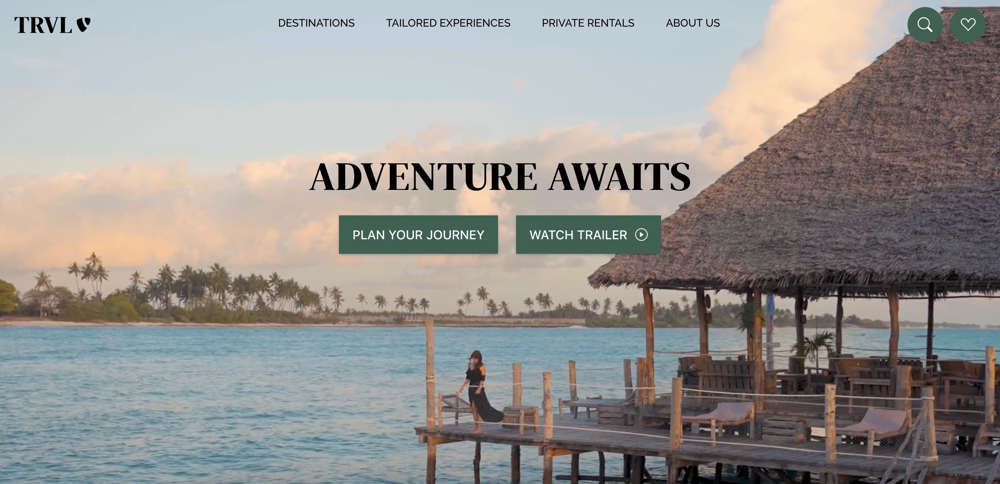

# React Travelsite 
React site I created to practice working with Styled components, React Router and React in general.

[https://trvl-agency.netlify.app/](https://trvl-agency.netlify.app/)

## Installation
1. Clone the repo\
`git clone https://github.com/malin-nilsson/React-Travelsite`

2. Install npm packages\
`npm install`

3. Run React\
`npm start`

## Author
- GitHub - [malin-nilsson](https://github.com/malin-nilsson)
